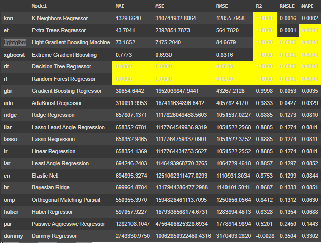
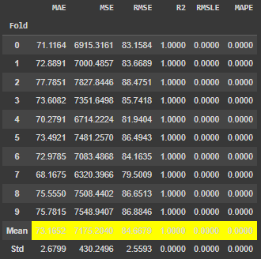
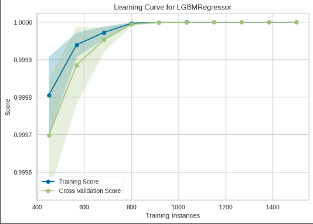
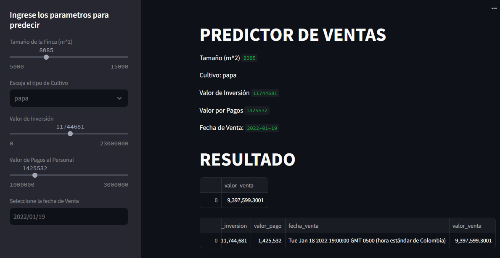

# Analisis-de-ventas
Modelo de machine learning hecho en pycaret que analiza datos de cultivos para predecir futuras ventas

# Por: Jonathan David Rosero

En el presente repositorio se encontrará el diseño de un modelo de machine learning usando base de datos SQL, la libreria pycaret y Streamlit.

Los datos usados para entrenar el modelo pertenecen a variables que corresponden a cultivos de 3 fincas diferentes.

# Objetivo

El fin de este modelo se hacer predicciones sobre el valor de ventas de un cultivo en especifico, dependiendo del tamaño de la finca, tipo de cultivo, valor de inversión, pagos al personal de la finca y la fecha en la que se vende el producto.

# Procedimiento

Una vez acondicionada nuestra base de datos con los datos requeridos se el entrenamiento de varios modelos de machine learning haciendo uso de la libreria pycaret, esto con el,objetivo de realizar una comparacion entre diversos modelos y escoger el que mejor presicion tenga, como se muestra acontinuación:

Luego de haber escogido el modelo que mejor se ajustabá se procede a realizar nuevas pruebas, estas consiten en realizar nuevas particiones de datos de testeo en la base de datos original y asi obtener diferentes scores con los que se define si el modelo se entreno correctamente, acontinuación se muestra las metricas obtenidas:

Cabe aclarar que el modelo esta basado en regresión, por lo tanto, para la interpretación de los datos anteriores se considera bueno si el valor se aproxima a 0 a exepción de la metrica R2 la cual es b ueno cuando se aproxima a 1

En este caso con el modelo Light Gradient Boosting Machine los score no son tan buenos como lo seria con Extreme Gradient Boosting, pero al probar con datos nuevos ingresados en streamlit el modelo que mejor resultado ofrecia era el Light Gradient Boosting Machine.

A continuacion se presenta la grafica de leaning curve, la cual presenta un buen ajuste al entrenamineto y a los datos de validación:

# Interfaz

Por ultimo tenemos la interfaz de streamlit la cual posee objetos interactivos para que el usuario ingrese los datos que posea y asi obtener una estimación del valor de venta de su cultivo.

pd: La interfaz de Streamlit funciona solo para red local, por lo cual para que funcione se debe escribir el siguiente comando en la terminal de visual studio code "streamlit run main.py"